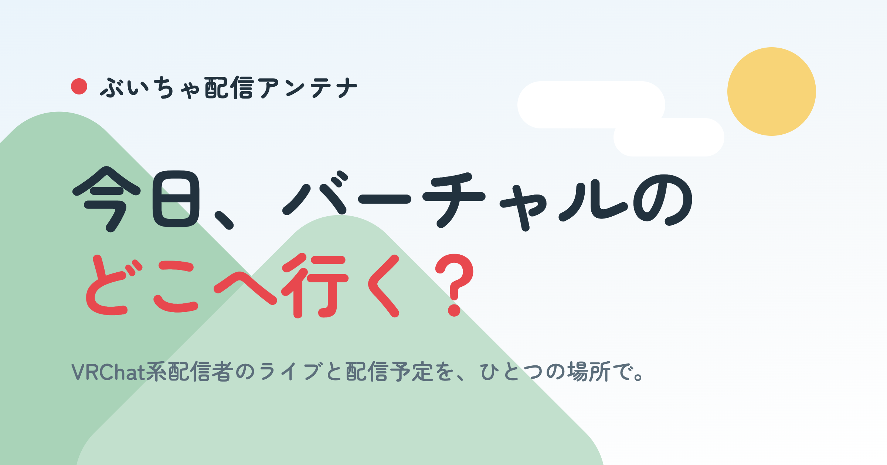

# ぶいちゃ配信アンテナ

VRChat系配信者のライブ配信と今後の配信予定を、ひとつの場所にまとめたスケジュールポータルです。

**🌐 https://hir0chan.github.io/VRSP/**



## 特徴

- **NOW ON LIVE** — 配信中のライブを最優先で大きく表示
- **本日の配信 / 今後の配信** — 配信予定を JST の日付ごとに整理
- **15分毎の自動更新** — GitHub Actions が YouTube Data API v3 と Twitch API から取得し、自動で再ビルド・再デプロイ
- **完全静的・メンテナンスフリー** — サーバ常駐なし、データベースなし。GitHub Pages のみで稼働

## 仕組み

```text
GitHub Actions (15分毎)
      │
      ▼
YouTube Data API v3 ─┐
                     ├── scripts/update.ts が取得
Twitch API ──────────┘   (YouTube は約1時間毎に検索、既知動画と Twitch ライブは15分毎に更新)
      ▼
data/generated/*.json ── 差分があれば bot がコミット
      │
      ▼
Astro build ── JSON をビルド時に読み込み静的 HTML 化
      │
      ▼
GitHub Pages
```

- `search.list` の live / upcoming / completed 3検索で VRChat 動画を発見し、発見済み動画は `videos.list` で継続追跡します
- タイトルまたは説明文に「VRChat」を含むライブ配信だけを掲載します
- Twitch は VRChat カテゴリの配信中ライブを取得し、成人向け指定の配信を除外します
- 発見は60分のクールダウンでクォータを抑え、状態更新の部分失敗時は該当動画の前回データを保持します
- `YOUTUBE_API_KEY` 未設定の環境では YouTube・Twitch とも自動的にモックデータで動作します。実データ取得時に Twitch 認証情報が未設定なら YouTube のみで更新します

## 技術スタック

Astro / TypeScript (strict) / YAML / YouTube Data API v3 / Twitch API / GitHub Actions / GitHub Pages

## 開発

```sh
npm install
cp .env.example .env   # API 認証情報を記入(YOUTUBE_API_KEY がなければモックで動作)
```

| コマンド | 内容 |
|---|---|
| `npm run dev` | 開発サーバー起動(http://localhost:4321/VRSP/) |
| `npm run update` | 配信データ取得・`data/generated/` 更新 |
| `npm run build` | 本番ビルド |
| `npm test` | テスト実行 |
| `npm run check` | 型チェック(astro check + tsc) |

## 配信者の追加

配信者リストの登録は不要です。YouTube の検索結果と Twitch の VRChat カテゴリから条件に合う配信を自動取得し、配信者情報も API データから生成します。

自動掲載から除外するチャンネルは `data/blocklist.yaml` に `channelId` を追加します。`note` は任意です。

```yaml
- channelId: UCxxxxxxxxxxxxxxxxxxxxxx
  note: 除外理由
```

## 掲載について

本サイトはすべての VRChat 配信者・コンテンツを網羅しているわけではありません。また、取得の仕組み上、VRChat 以外のコンテンツが掲載されることがあります。掲載の削除をご希望の場合は X [@hir0chan_vrc](https://x.com/hir0chan_vrc) までご連絡ください。

## 作者

**hir0chan** — [X @hir0chan_vrc](https://x.com/hir0chan_vrc) / [GitHub](https://github.com/hir0chan)
